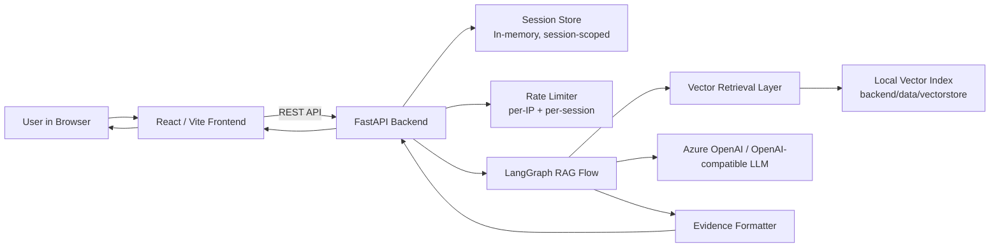
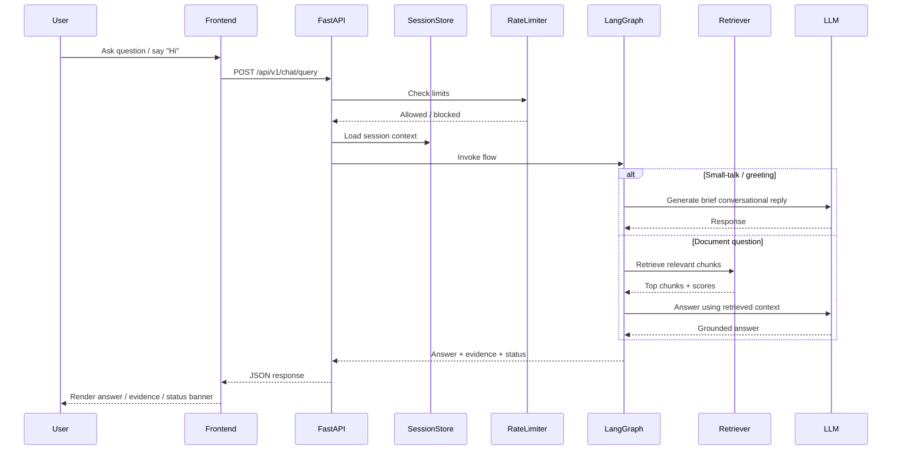

# Conversational Barbie PDF Assistant

A public-facing agentic RAG app that answers questions over `data/barbie.pdf`.

It includes:
- **React + Vite** frontend
- **FastAPI** backend
- **LangGraph** orchestration
- **Azure OpenAI** or OpenAI-compatible chat support
- **Azure/OpenAI embeddings** for retrieval
- **page-referenced evidence snippets**
- **anonymous session-based conversation memory**
- **LLM-powered small-talk / greetings**
- **basic rate limiting**

---

## Features

- Ask questions about the Barbie PDF
- Get grounded answers with evidence snippets and page references
- Continue with follow-up questions in the same session
- Start a new conversation to reset context
- Handle greetings like `Hi` and `Hello` with LLM-generated responses
- Reject empty or whitespace-only questions
- Return insufficient-evidence responses instead of hallucinating

---

## Architecture



---

## Request Flow



---

## Project Structure

```text
backend/
├── app/
│   ├── api/
│   ├── core/
│   ├── graph/
│   ├── ingestion/
│   ├── observability/
│   ├── retrieval/
│   └── services/
├── data/
│   └── vectorstore/
└── pyproject.toml

frontend/
├── src/
│   ├── app/
│   ├── features/chat/
│   ├── services/
│   └── types/
└── package.json

data/
└── barbie.pdf
```

---

## Setup

### 1. Backend

```bash
cd backend
python -m venv .venv
source .venv/bin/activate
pip install -U pip
pip install -e .
```

Create `backend/.env`.

### Option A — Native Azure OpenAI

```env
LLM_PROVIDER=azure
MODEL_API_KEY=your_azure_openai_api_key
AZURE_API_VERSION=2024-12-01-preview
AZURE_OPENAI_ENDPOINT=https://your-resource-name.openai.azure.com/
AZURE_CHAT_DEPLOYMENT=your-chat-deployment-name
AZURE_EMBEDDING_DEPLOYMENT=your-embedding-deployment-name
CHAT_MODEL=your-chat-deployment-name
EMBEDDING_MODEL=your-embedding-deployment-name
PDF_SOURCE_PATH=/absolute/path/to/your/repo/data/barbie.pdf
VECTORSTORE_DIR=/absolute/path/to/your/repo/backend/data/vectorstore
SESSION_TTL_MINUTES=30
RATE_LIMIT_REQUESTS_PER_MINUTE=20
RATE_LIMIT_BURST=5
TOP_K_RESULTS=4
```

### Option B — OpenAI-compatible provider

```env
LLM_PROVIDER=openai
MODEL_API_KEY=your_api_key_here
MODEL_BASE_URL=https://api.openai.com/v1
CHAT_MODEL=your_chat_model_or_deployment_name
EMBEDDING_MODEL=your_embedding_model_or_deployment_name
PDF_SOURCE_PATH=/absolute/path/to/your/repo/data/barbie.pdf
VECTORSTORE_DIR=/absolute/path/to/your/repo/backend/data/vectorstore
SESSION_TTL_MINUTES=30
RATE_LIMIT_REQUESTS_PER_MINUTE=20
RATE_LIMIT_BURST=5
TOP_K_RESULTS=4
```

> `backend/.env.example` is safe to commit. Do **not** commit `backend/.env`.

---

### 2. Frontend

```bash
cd frontend
npm install
```

Create `frontend/.env.local`:

```env
VITE_API_BASE_URL=http://localhost:8000/api/v1
```

---

## Build the PDF Index

This step parses `data/barbie.pdf`, chunks the text, and generates embeddings for retrieval.

```bash
cd backend
source .venv/bin/activate
python -m app.ingestion.build_index
```

Expected output artifacts:
- `backend/data/vectorstore/metadata.json`
- `backend/data/vectorstore/chunks.json`

To verify embeddings mode:

```bash
python - <<'PY'
import json
from pathlib import Path

meta = json.loads(Path('data/vectorstore/metadata.json').read_text())
chunks = json.loads(Path('data/vectorstore/chunks.json').read_text())
print('retrieval_mode =', meta.get('retrieval_mode'))
print('chunk_count =', len(chunks))
print('first_chunk_has_embedding =', bool(chunks and chunks[0].get('embedding')))
PY
```

You want to see:
- `retrieval_mode = embeddings`
- `first_chunk_has_embedding = True`

---

## Run the App

### Start backend

```bash
cd backend
source .venv/bin/activate
uvicorn app.main:app --reload --port 8000
```

### Start frontend

```bash
cd frontend
npm run dev
```

Then open the frontend in your browser.

---

## API Endpoints

- `GET /api/v1/health`
- `POST /api/v1/chat/sessions`
- `DELETE /api/v1/chat/sessions/{sessionId}`
- `POST /api/v1/chat/query`

---

## Example Smoke Test

Create a session:

```bash
curl -X POST http://localhost:8000/api/v1/chat/sessions
```

Ask a question:

```bash
curl -X POST http://localhost:8000/api/v1/chat/query \
  -H 'Content-Type: application/json' \
  -d '{
    "session_id": "replace-with-session-id",
    "question": "What is Barbie about?"
  }'
```

Try a greeting:

```bash
curl -X POST http://localhost:8000/api/v1/chat/query \
  -H 'Content-Type: application/json' \
  -d '{
    "session_id": "replace-with-session-id",
    "question": "Hi"
  }'
```

---

## Notes

- Session memory is **anonymous and session-scoped only**.
- Backend restarts can invalidate in-memory sessions.
- The frontend includes session auto-recovery for expired/missing sessions.
- Retrieval is limited to the single `data/barbie.pdf` source.
- Small-talk is LLM-routed, while document questions use retrieval + answer synthesis.

---

## Development References

- Pi Spec-Kit package: https://pi.dev/packages/@the-agency/pi-spec-kit?page=46
- Spec workflow example: `sample_conversation.md`
- Feature spec: `specs/001-agentic-rag-app/spec.md`
- Plan: `specs/001-agentic-rag-app/plan.md`
- Tasks: `specs/001-agentic-rag-app/tasks.md`
